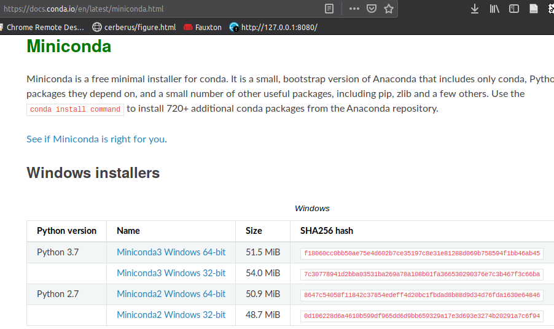

---


<!-- theme: default -->

# Python


Python is a general purpose and high level programming language. It is not a compiled language. It favors structured programming based on scripts, functional programming and object oriented programming.

<!-- footer: #pythonclub - 001  -->
<!-- size: 16:9 -->

---

# Workshops: "methodology"

During these workshops, you can decide to either:
1. Run and use Python from your current OS
2. Run and use Python from a Linux Virtual Machine

Ideally, it is a good opportunity to use a **Linux Virtual Machine**


But, we are going to get started with a Python distribution.

---
# The two pythons

```
ilyass@tx1:~$ python2
Python 2.7.16 (default, Apr  9 2019, 04:50:39) 
[GCC 8.3.0] on linux2
Type "help", "copyright", "credits" or "license" for more information.
>>> 2 + 2
4
>>> exit()
ilyass@tx1:~$ python3
Python 3.6.8 (default, Apr  9 2019, 04:59:38) 
[GCC 8.3.0] on linux
Type "help", "copyright", "credits" or "license" for more information.
>>> 2 + 2
4
>>> exit()
```

Python2 is still supported until 2020. Python3 has been around since 2008. We will be using Python3.

---

# Anaconda / Miniconda
 
Anaconda provides easy access to a large amount of scientific packages for the `R` or Python languages. Miniconda is a lightweight version of Anaconda, only the essential packages



Download Miniconda Python 3 for your OS and install it.

---

# Prompt shell

Start your Anaconda Prompt, then load Python.


---