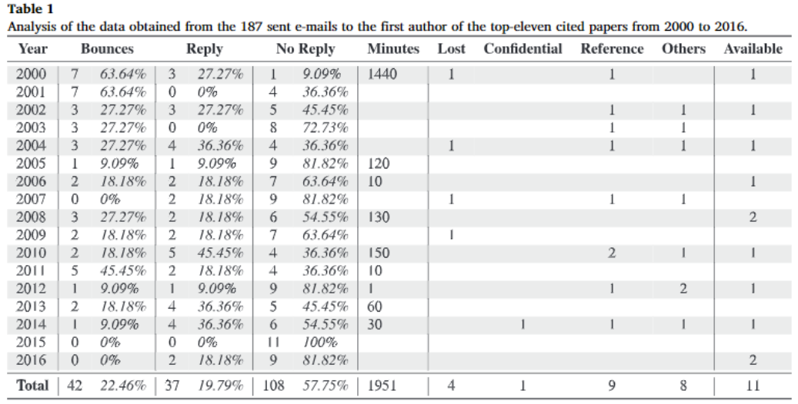

<!-- $theme: default -->

---
# Where you stand

### Goals
* Learn python
* Make cool stuff with python

### Are you comfortable with:
* Terminal (ubuntu)
* python
* git

If so, you will be part of the group **Produt**, otherwise, you are part of **Learning**.

<!-- footer: #pythonclub - 001  -->
<!-- $size: 16:9 -->

---

# Learning

1. **Linux**
2. **Terminal**
3. **python**
4. **git** : version control system

# Requirements ?

* Focus to quickly move on to **Product group**
* **Product group** members will support you all the time
* Practice **python** outside of the #pythonclub
---

# Why learn python ?

*Life is short, you need python.* 
Bruce Eckel,  ANSI C++ Comitee member, author of «Thinking in C++» and «Thinking in Java»

  

*The goal of a modern education is to nurture a person to adulthood, someone who is capable of solving the tough problems of tomorrow. However, in schools we are taught to memorize and regurgitate. Most students don’t come close to an exploratory, iterative, problem solving education.*
Michele Pratusevich, and in my day job I am a research engineer

---
# Empowering yourself ...: 
#### State of reproducibility in *damage mechanics* ? https://arxiv.org/abs/1803.07622

<!-- *footer: Long term availability of raw experimental data in experimental fracture mechanics, Patrick Diehl, Ilyass Tabiai, Felix W. Baumann, Daniel Therriault, Martin Levesque  -->

---
# ... thanks to python

python was used to:

* Retrieve top 11 papers per year for a specific request as Bibtex file
* Parse Bibtex files to extract `Author Name`, `Publication Year`, `Publication Title` for each publication
* Automatically generate mail with `Author Name`, `Publication Year`, `Publication Title`
* Automatically send 189 e-mails to different e-mail addresses

https://github.com/OpenDataExpMechanics/Survey/tree/1.0
http://www.openexpmechanics.science/

---
# Learning group 101: python

* Download/Install Virtual Box and Ubuntu: https://goo.gl/VgdEMx

**Two persons per computer, switch every 12 minutes**: http://www.intervaltimer.com/

* When you are logged in Ubuntu, open FireFox: https://github.com/ilyasst/python3_getstarted and go through:
  * 001-installing-python3.md
  * 002-using-pythonshell.md
* Then, go through: https://www.practicepython.org/exercise/2014/01/29/01-character-input.html
* Then this one: https://www.practicepython.org/exercise/2014/02/05/02-odd-or-even.html
* Next is: https://www.practicepython.org/exercise/2014/03/05/05-list-overlap.html

#### Next time : `if` and `for` loops, scripting and functions

---
# Product group: proposal

#### Requirements

* A project which could lead to something *published* at some point, or which helps us build tools that could be used to publish something
* A project which involves python and maybe some Machine Learning
* Project requires several modules which would force us toward Object Oriented Programming (classes) and collaboration (git)

#### Proposal : Scientific publication recommendations

* Generate a classifier from a specific bitex file using abstract or full text (tokenizing, TF-IDF, MultinomialNB *(?)*)
* Retrieve latest publications from Elsevier/ArXiv/Core/... APIs
* Run them through the classifier and determine if user will be interested by publication or not

---

# Product group: organizing

#### Tools acquired

* Ability to interact with publishers/repositories' APIs
* Recommendation through ML
* Bibtex parsing tool

#### Tasks/Teams

* API team
* Bib parser team
* Tokenization/MultinomialNB team

#### Learning group
* A **different** member (or several) of the product team will be responsible for the learning team for each session

---