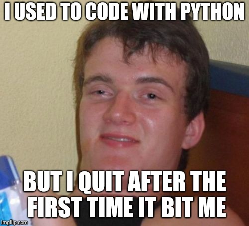
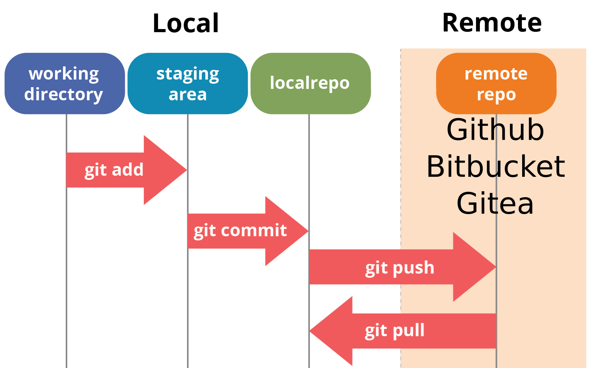

<!-- $theme: default -->
<!-- footer: #pythonclub - 04  -->
<!-- $size: 16:9 -->

# pythonclub 04

---

# pythonclub 04

Start your VM, open your terminal (`Ctrl+Alt+T`) and try to type the commands shown on screen, we're going to go through:

* git

Then: `PROJECT`

---

# git

  

---

# git: we do it

1. Let's create a repository in the pythhonclub
2. You are now going to pull this repository
   * Go to the repository's webpage: https://github.com/pythonclubmtl/
   * Click `Clone or Download` and copy the repo's link
   * Open your terminal, go to your `Repositories` folder, and input:
	`git clone <repository>` 

In the next steps, you are going to send your first contribution to a repoistory.
When you feel that you should submit your code on the remote repository (github), you will have to prepare the data you are sending using commits:
1. We decide what we want to send
2. We put it in a box
3. We add note explaining why we're sending it, then we ship it

<!-- footer:  -->

---

# git: you do it

3. Create a file in your local repo called : `<yourname>.md`
4. Let's send this file to the distant repo
   * In the repo folder, input :
   1. Check what's up: `git status`
   2. Put files you want to commit in a box: `git add <yourname>.md`
   3. Add a note to explain why/what you are comitting:
	 `git commit -m "My first commit ever"`
   4. Send the data: `git push origin master`
   5. Pull to get latest commits: `git pull origin master`

* This the basic git workflow that we'll be using to collaborate (we'll update this later)
* It's usually better to pull before pulling
* Add a message in one of the `<yourname>.md` and push it back

---

# git: explore

Go to the `pythonclubmtl/meetings` repo and click on `XX commits`:

* Click on any commit's name to check modifications
* Click on `Browse files` or `<>`to revert the repository as it was when that commit happened
* Try the split views to easily see updates
* Click next to a line number after clicking on a commit to add a question, remark or blame (tag me using `@ilyasst`)
* Notice those `Merge` commits, we will not expand on those know, but that is what happens when I work on the same file from two different computers

Github is just an interface, you can actually do all of this while offline from your terminal. The `.git` folder in each repo contains all the necessary data.

