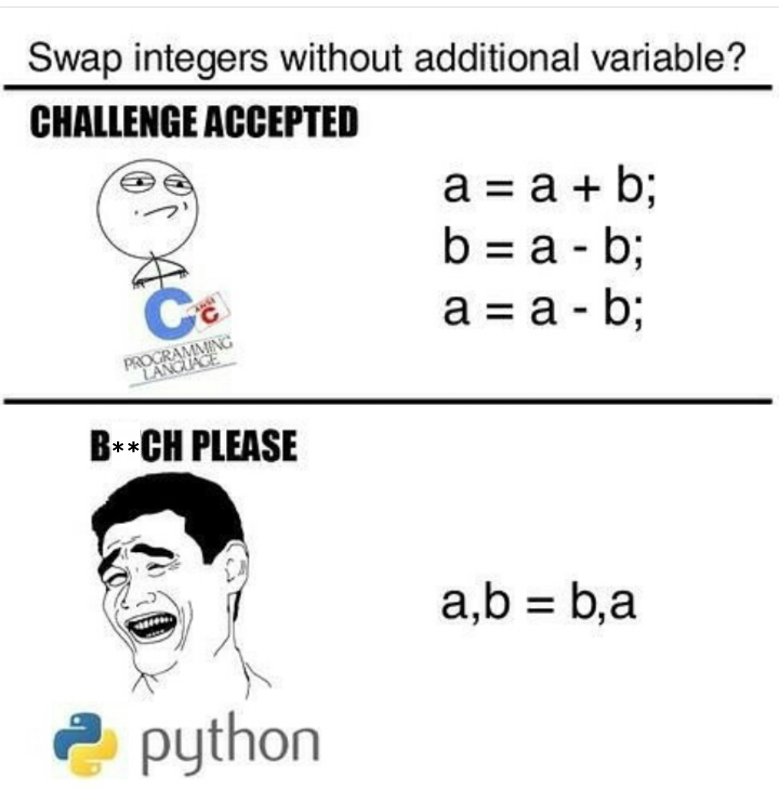

<!-- $theme: default -->
<!-- footer: #pythonclub - 05  -->
<!-- $size: 16:9 -->

# pythonclub 05



```
>>> a=3
>>> b=4
>>> a,b=b,a
>>> a
4
>>> b
3
```

<!-- *footer:  -->

---

# Zotero

> Your personal research assistant
> Zotero is a free, easy-to-use tool to help you collect, organize, cite, and share research.

* Grabs data firectly from the browser
* Possible to search in PDF of all your biblio
* Shared libraries (I add something, you see it)
* Possible to export library to use it from Word or from Latex
* Demo

Zotero is **highly** recommended, especially if you work with publications

---

# Project: Use Case

1. I export my library from (`.bib`) Zotero / EndNote / Mendeley / Docear / JabRef
2. I contact our bot (`IbnBOTuta`) and send my `.bib` file
3. The bot transfers the file to our python code that:
	* Extracts available data (extracts abstracts, titles, keywords, authors)
	* Analyzes **all** titles and abstracts to determine actual keywords and generates a classifier
	* Queries Elsevier/WebOfScience/Scopus/Core using the actual keywords
	* Uses **my** classifier to filter papers and only keep the ones similar to my `.bib`
4. The slack bot sends back the link to each paper that was deemed relevant

Techniques/Methods necessary: **Supervised Machine Learning**, intro to **Natural Language Processing**, **Data Processing**, **REST API** interactoin, intro to **bots**

> This is a learning project.

---

# Project: implementation

#### Analyze a bibliography and provide an analysis
* Extract publications keywords and most reccurent authors
* Provide a corpus made of all abstracts or titles concatenated
* Find keywords (intro to Natural Language Processing)

#### Slack
* Create a slack bot, implement commands
* Deploy bot on our Slack

### Clustering/Classification
* Query the Elsevier API (or/and others)
* Determine if papers sent by Elsevier API are relevant based on a given corpus

---

# Project: leads

We will all use the same repository: `pythonclubmtl/paperflix`

* **Slack**:  `learning_python3/slackbot/making_a_slackbot.md`
* **Elsevier API team**: `pythonclubmtl/paperflix/modules/learningelsevier.py`
	* Wassim will guide you to get data from a query
* **Natural Language Processing**: 
	* Pip and install: https://github.com/csurfer/rake-nltk 
	* Reproduce quick start example on any text you like (more than 5000 words)
* **Bibtex**:
	* Install : https://github.com/csurfer/rake-nltk
	* Apply: https://docs.pybtex.org/api/parsing.html to `paperflix/examples/Biblio.bib`

Choose a team. If there is an empty team, it is fine, the work will have to be done anyways later.

---

# Project: tasks

We will all use the same repository: `pythonclubmtl/paperflix`

### Slack  

* Follow: `learning_python3/slackbot/making_a_slackbot.md` 
* Once you have a bot that can send messages, use `SlackClient`'s documentation to get your bot to answer certain commands:
	* If I (a human user) send "Hello", the bot answers "Hello", if I send "Bye", the bot answers "Bye"
	* Get your bot to accept files sent by users

Create a `bot.py` file in `pythonclubmtl/paperflix/modules`, all bot related functions should be stored there, but we need to exectute them from `main.py` (don't worry too much about this for now).

---

# Project: tasks

We will all use the same repository: `pythonclubmtl/paperflix`

### Elsevier API team  

* Install elsapy 

Create a `bot.py` file in `pythonclubmtl/paperflix/modules`, all bot related functions should be stored there, but we need to exectute them from `main.py` (don't worry too much about this for now).

---

# Classes

* Once our code is functional, we will pause the project and have a session about **Classes** (Object Oriented Programming)
* We will then refactor our code using classes

---